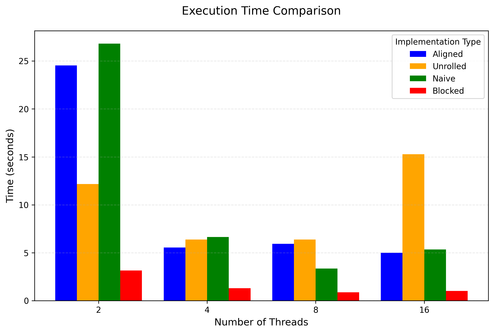
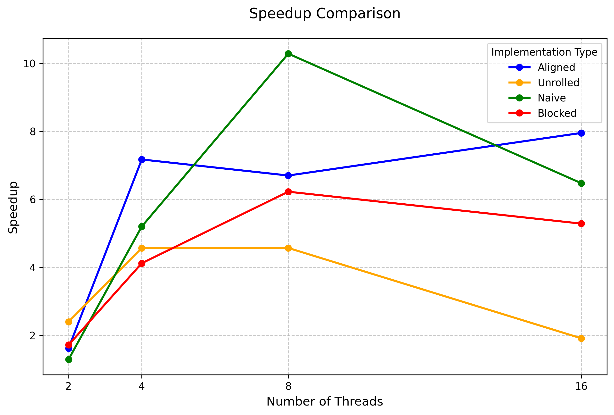
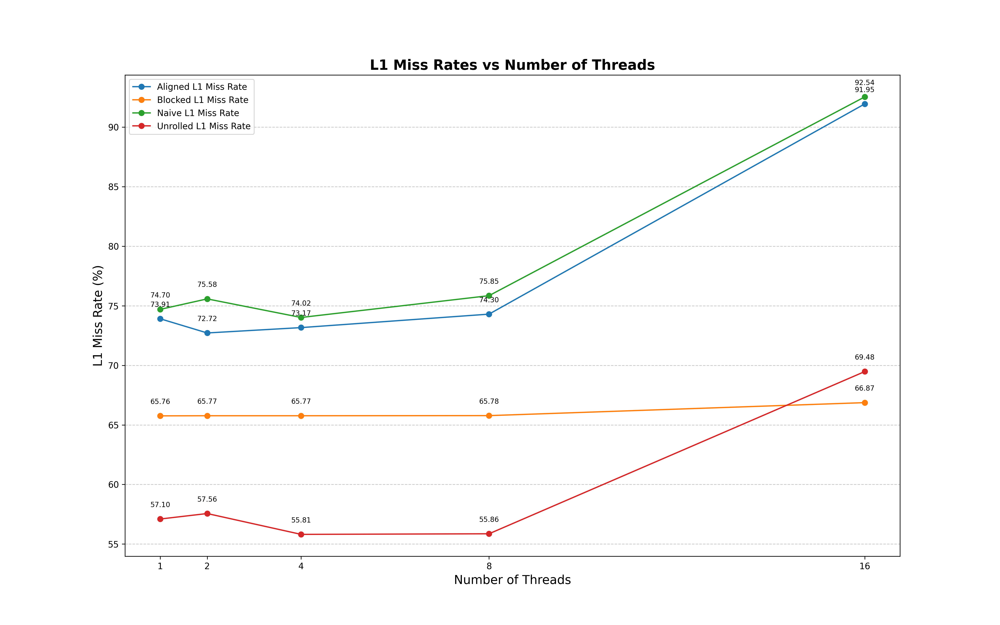
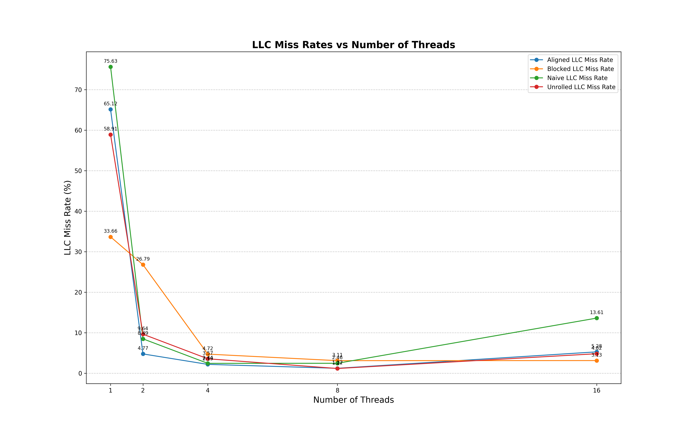
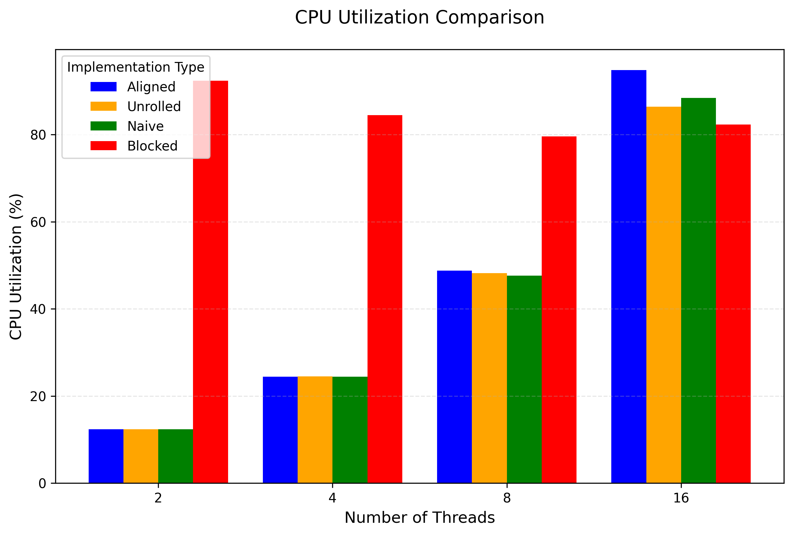

# Matrix Multiplication Optimization Project

This project implements and evaluates advanced optimization techniques for matrix multiplication, including loop unrolling, cache blocking, and explicit memory alignment. The performance is analyzed in terms of execution time, speedup, cache miss rates, and CPU utilization. Multi-threading is achieved using OpenMP, with detailed profiling using Intel VTune.

---

## Project Structure

### Key Components
1. **`src/`**:
   - **`matmul_naive.c`**: Baseline triple-nested loop implementation.
   - **`matmul_unrolled.c`**: Optimized with inner loop unrolling for reduced overhead.
   - **`matmul_blocked.c`**: Employs cache-blocking to improve memory locality.
   - **`matmul_aligned.c`**: Explores memory alignment to reduce cache misses.
   - **`test_matmul.c`**: Integrates and tests all methods for correctness and performance consistency.

2. **`logs/`**:
   - Performance logs including cache miss rates and CPU utilization.
   - Examples: `Aligned_cache_misses.log`, `Blocked_cache_misses.log`.

3. **`graphs/`**:
   - Visualizations comparing performance metrics:
     - Execution time (`execution_time.png`)
     - Speedup (`speedup.png`)
     - Cache miss rates (`l1_miss_rates_chart.png`, `llc_miss_rates_chart.png`)
     - CPU utilization (`cpu_utilization.png`)

4. **`scripts/`**:
   - **`cache_analysis_draw.py`**: Visualizes cache miss data.
   - **`compare_threading.py`**: Analyzes performance scaling with thread count.
   - **`run_vtune_analyses.sh`**: Automates Intel VTune profiler runs.

5. **`report/`**:
   - Detailed project documentation summarizing methodology, results, and conclusions.

---

## Optimization Techniques

1. **Cache Blocking (Tiling)**:
   - Improves data reuse by dividing matrices into smaller blocks that fit into the CPU cache.
   - Implemented in `matmul_blocked.c`, with configurable block size.

2. **Memory Alignment**:
   - Aligns memory addresses to cache line boundaries (64 bytes) to optimize memory access patterns.
   - Demonstrated in `matmul_aligned.c`.

3. **Loop Unrolling**:
   - Reduces loop overhead by processing multiple iterations per loop cycle.
   - Example: Unrolling by a factor of 4 in `matmul_unrolled.c`.

4. **Threading**:
   - All methods leverage OpenMP for parallel execution, with dynamic thread management.

---

## Graphs and Results

### Execution Time
Comparison of execution times for different methods and configurations.

### Speedup
Speedup achieved by each optimization technique relative to the naive implementation.

### Cache Miss Rates
- **L1 Cache Miss Rates**:
  Highlights the percentage of cache misses at the L1 level.
  

- **LLC (Last-Level Cache) Miss Rates**:
  Demonstrates memory access efficiency.
  

### CPU Utilization
Shows the CPU utilization across different implementations and thread counts.

---

## Scripts and Automation

1. **Performance Automation**:
   - `measure_cache_misses.sh`: Automates the collection of cache miss statistics.
   - `run_vtune_analyses.sh`: Executes VTune profiler tasks for each method.

2. **Visualization**:
   - `cache_analysis_draw.py`: Generates cache miss rate charts.
   - `compare_threading.py`: Produces threading scalability plots.

---

## Conclusion

This project demonstrates the significant performance improvements that can be achieved using advanced optimization techniques such as blocking, unrolling, and memory alignment. 

### Key Insights:
- **Blocking and alignment** drastically reduce cache misses, improving both memory-bound and compute-bound performance.
- **Loop unrolling** minimizes overhead and improves throughput.
- **CPU utilization** scales efficiently with thread count in optimized implementations.

Explore the scripts and visualizations to dive deeper into the performance characteristics of each technique.

For further details, refer to the project report in the `report/` directory.

