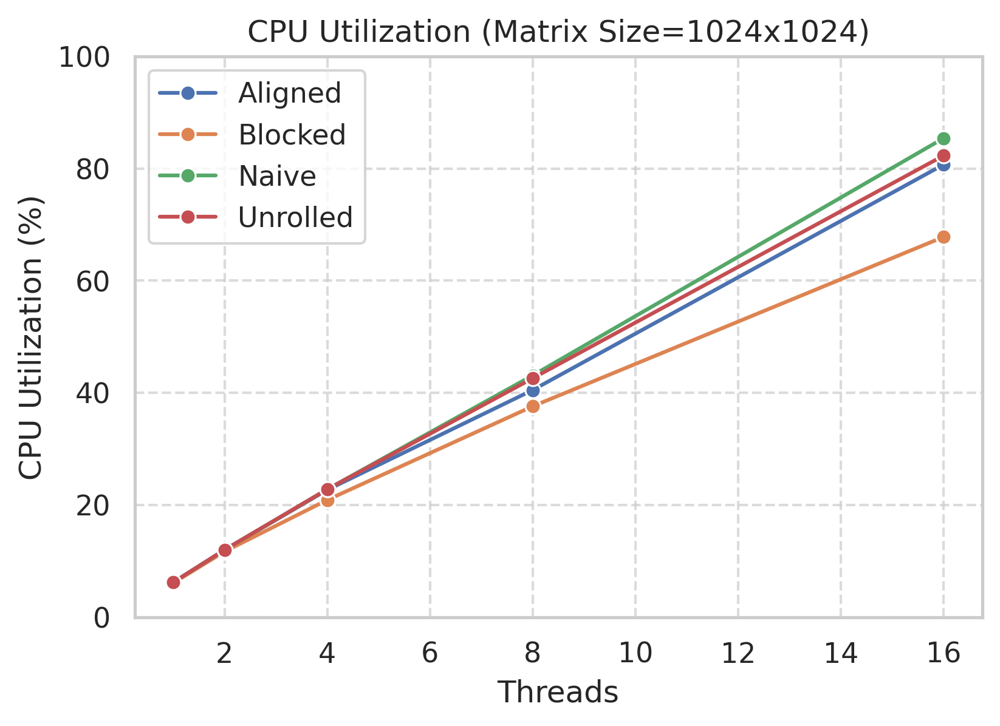
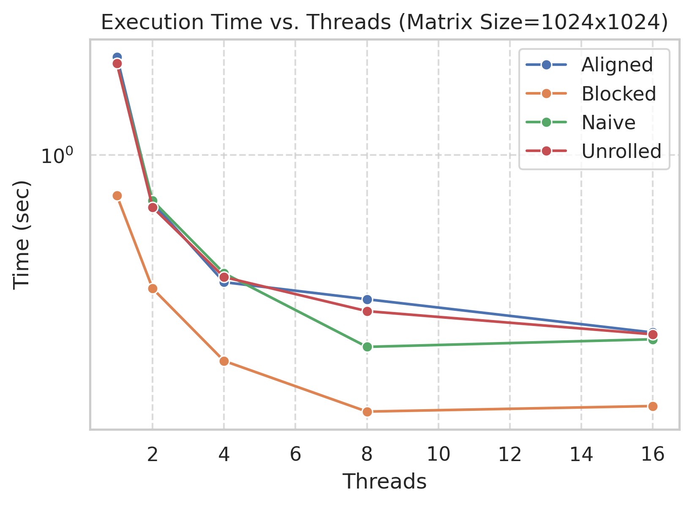
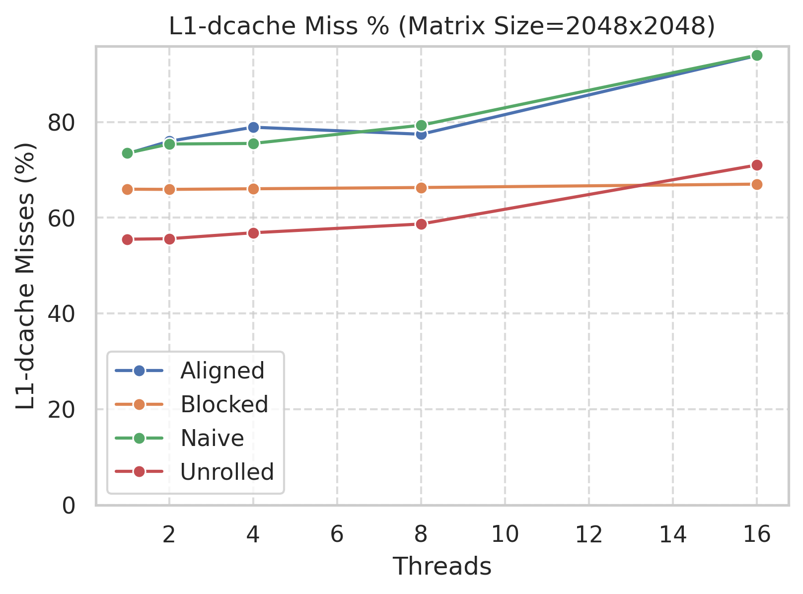
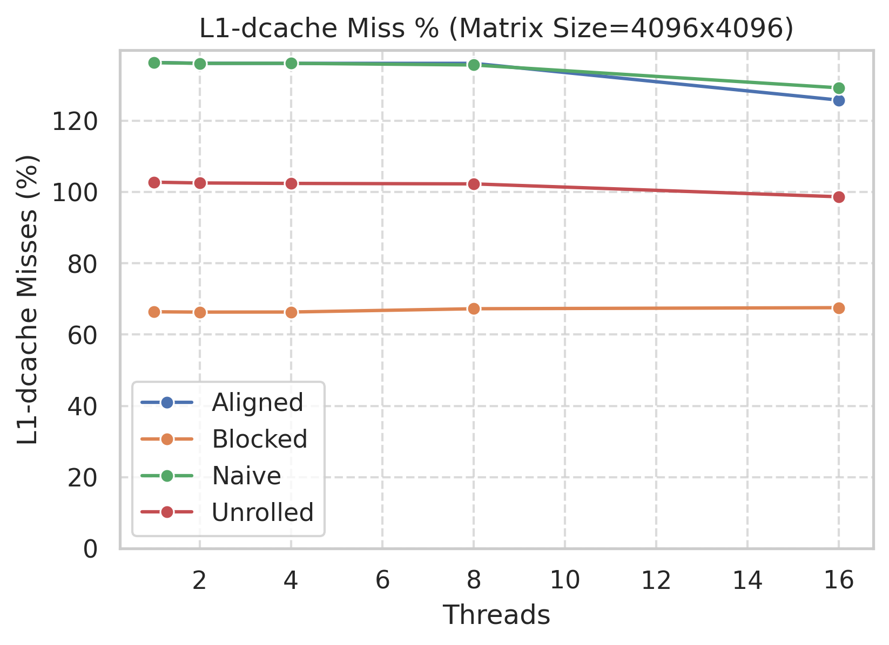
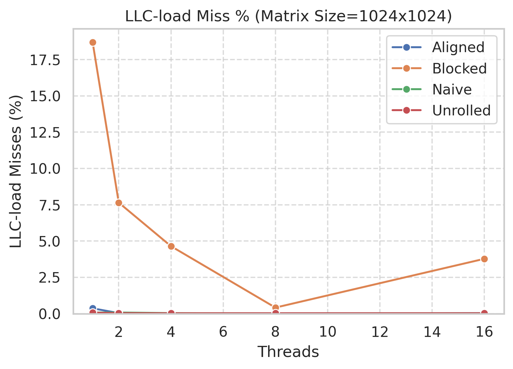
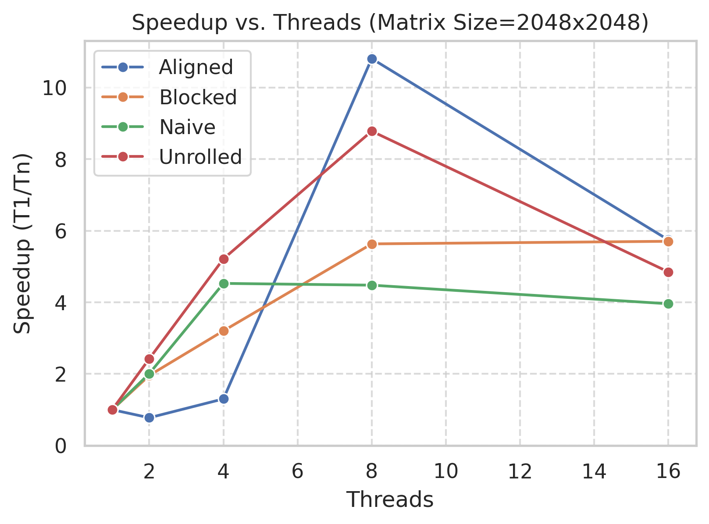

# Matrix Multiplication Optimization Project

A compact yet powerful demonstration of matrix multiplication optimizations using **cache blocking**, **memory alignment**, **loop unrolling**, and **multi-threading (OpenMP)**.

## Highlights

- **Naive vs. Optimized**  
  Compare a simple triple-nested loop (`matmul_naive.c`) against optimized approaches (cache-blocked, aligned, unrolled).

- **Multi-threading**  
  All methods support **OpenMP** for parallel execution and improved CPU utilization.

- **Analysis**  
  Profiling with **Intel VTune** plus custom scripts yields metrics on:
  - **Execution Time**
  - **Speedup**
  - **L1/LLC Cache Miss Rates**
  - **CPU Utilization**

## Directory Overview

- **`src/`**  
  - Core implementations (`matmul_naive.c`, `matmul_blocked.c`, etc.)
  - `test_matmul.c` for validation and performance checks

- **`logs/`**  
  - Recorded performance data (cache miss rates, CPU usage)

- **`graphs/`**  
  - Plots illustrating key performance metrics (shown below)

- **`scripts/`**  
  - Automation and visualization scripts (e.g., `cache_analysis_draw.py`, `compare_threading.py`)

- **`report/`**  
  - Methodology, results, and conclusions in a concise PDF/Markdown document

---

## Detailed Graphs

Below are **all** of the generated PNGs, separated by metric and matrix size.

### 1) CPU Utilization

**N = 1024**  

**N = 2048**  

**N = 4096**  

---

### 2) Execution Time

**N = 1024**  

**N = 2048**  

**N = 4096**  

---

### 3) L1-dcache Miss Percentage

**N = 1024**  

**N = 2048**  

**N = 4096**  

---

### 4) LLC-load Miss Percentage

**N = 1024**  

**N = 2048**  

**N = 4096**  

---

### 5) Speedup

**N = 1024**  

**N = 2048**  

**N = 4096**  

---

## Conclusion

By integrating **cache blocking**, **memory alignment**, **loop unrolling**, and **multi-threading**, we significantly reduce cache misses and boost CPU utilization. Check out the **logs** for raw data, **graphs** for visual insights, and the **report** folder for a comprehensive discussion of these results.
